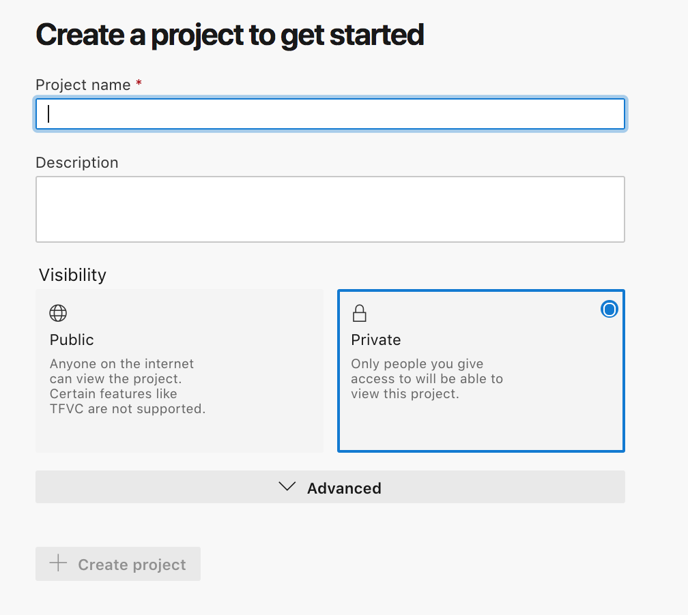
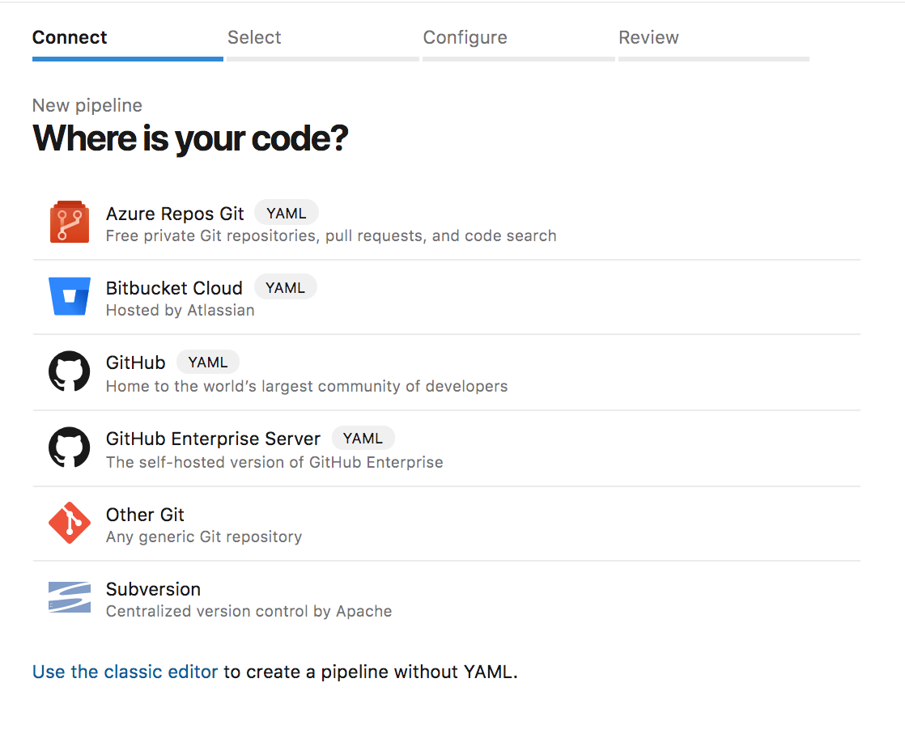
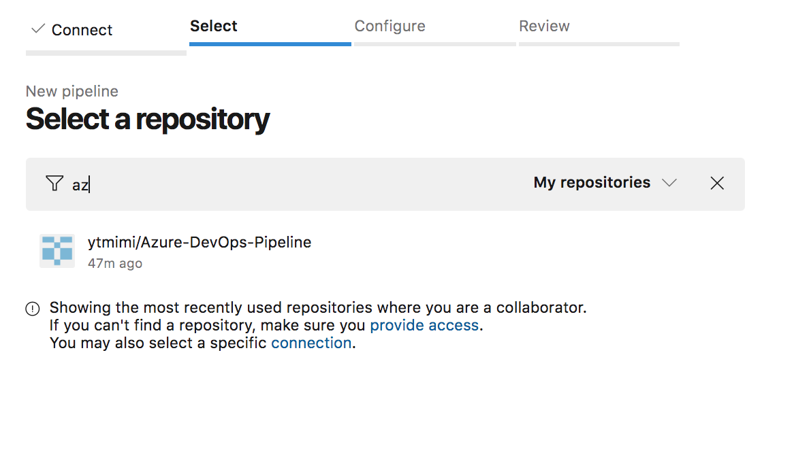
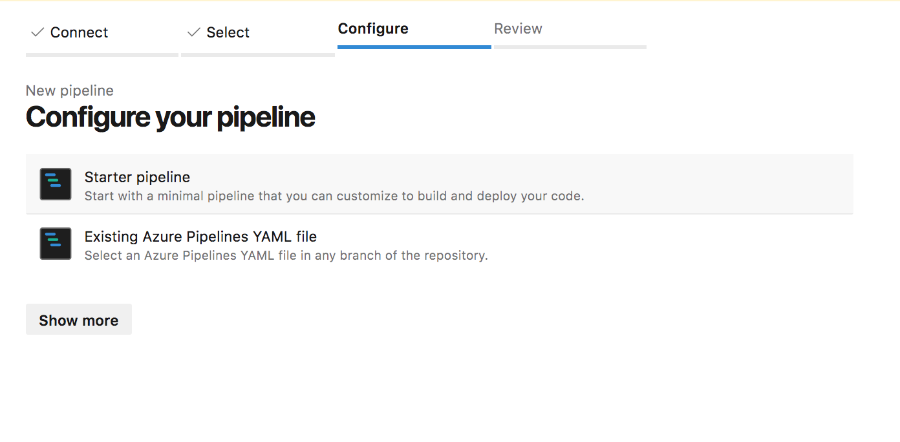
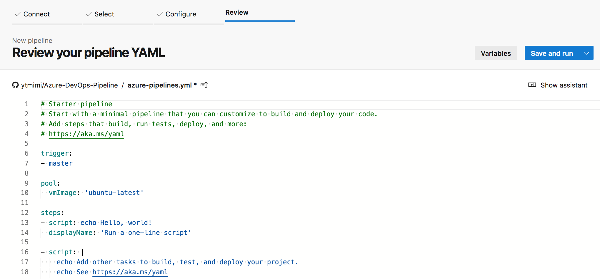
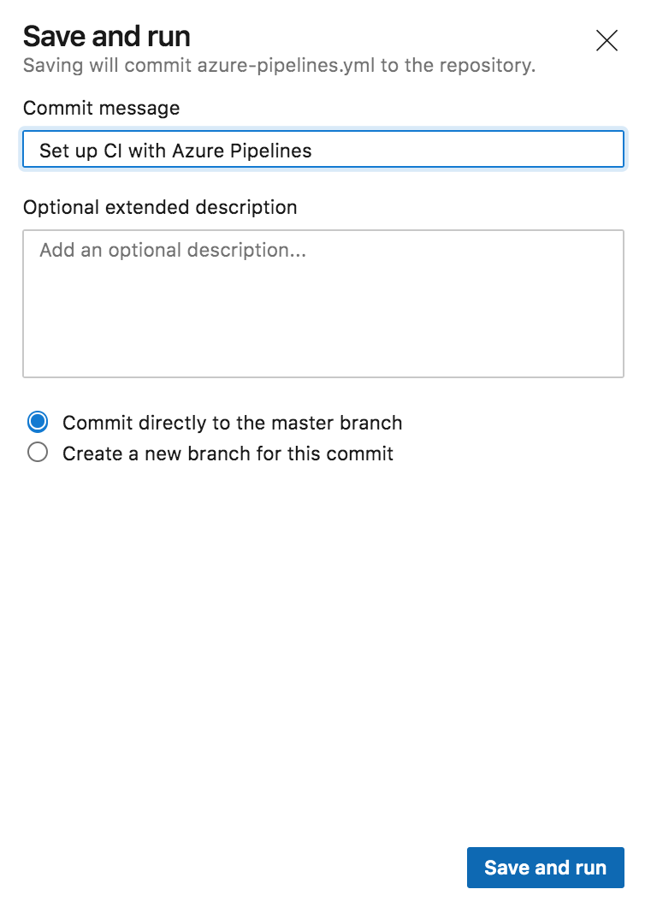

Setup an Azure Pipeline
=======================

.. _Azure DevOps: https://docs.microsoft.com/en-us/azure/devops/get-started/index?view=azure-devops

Check out the official `Azure DevOps`_ documentation for complete details on all these steps.

When you get started with Azure DevOps you need to create an organization.
Once you've created an organization you can begin setting up Projects and Pipelines

================
Create a Project
================

Sign into you Azure DevOps organization and create a project

Once you've given you project a name and description click the create button.

=================
Connect Your Code
=================

Azure needs to know where to find your project. You have several different options to choose from.

For this example we'll select Github.

.. note::

    If you haven't connected with Github before, you'll be prompted to go through an Oauth
    step to allow Azure Pipelines to connect to your Github account.

======================
Select Your Repository
======================

After connecting to Github, Azure DevOps will list all your repositories.
Select the one you'd like to use for this project.
There is also a convenient search bar to help you find your project.

=======================
Configure Your Pipeline
=======================

You'll have the option to use a Starter Pipeline or an existing Azure Pipeline YAML file in the repository.
For the purpose of this example we'll go with the Starter Pipeline.

====================
Review Your Pipeline
====================

After you've selected the Pipeline you'll have the option to make any edits you want.
Each Pipeline is defined in a YAML file, which makes it easy to edit and include in your
version control system.

When you're ready click the ``save and run`` button in the upper right hand corner.

This will commit the azure-pipelines.yaml file to the repository.
